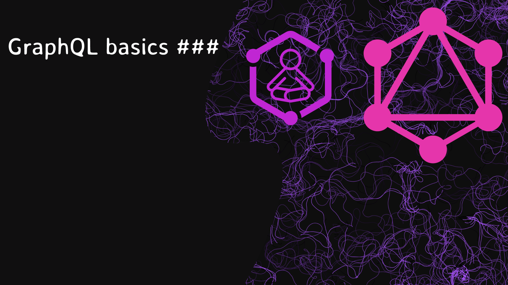
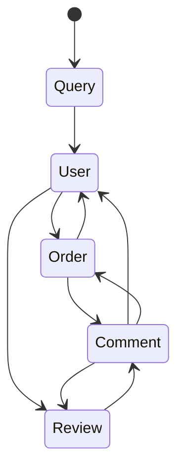

# graphql-basics




# Differance between REST APIS


### REST

- Endpoints: In RESTful APIs, endpoints represent resources, and each endpoint typically maps to a specific URI (Uniform Resource Identifier) representing a resource (e.g., /users, /posts).

- Multiple Endpoints: REST often requires multiple endpoints for different use cases or to retrieve varying amounts of data. For instance, you might have /users to get a list of users and /users/{id} to get a specific user.

- Fixed Structure: REST endpoints often return fixed data structures, and clients need to make multiple requests to different endpoints to fetch related data.

- Over-fetching and Under-fetching: Clients might receive more data than needed (over-fetching) or might need to make multiple requests to gather all the required data (under-fetching).

### GraphQL

- Single Endpoint: GraphQL typically uses a single endpoint. Clients request the exact data they need by sending queries to this endpoint.

- Flexible Queries: Clients can request specific fields and nested data structures in a single query, reducing over-fetching and under-fetching.

- Schema and Type System: GraphQL uses a strong type system to define the structure of the data. Clients can introspect the schema to understand what data can be requested.


In GraphQL, the HTTP response itself might not always return a traditional HTTP status code like `200 OK`. Instead, GraphQL typically returns a `200 OK` status code regardless of whether the query was successful or not.


This is because GraphQL has its own error-handling mechanism within the response body. Even if there are errors within the GraphQL query, the server will still respond with a `200 OK` status code. However, within the response body, there's a field called "errors" that would contain any errors encountered during the execution of the query.


The structure of a GraphQL response allows for both data and errors to be returned simultaneously. So, while the HTTP status code might consistently be `200 OK`, the actual success or failure of the query is indicated within the GraphQL response body itself.


**This approach allows for a consistent response format, making it easier for clients to handle both successful data and potential errors uniformly.**

```json
{
  "data": {
    "user": {
      "id": "123",
      "name": "John Doe",
      "email": "john@example.com"
    }
  },
  "errors": [
    {
      "message": "Unauthorized access",
      "locations": [
        {
          "line": 6,
          "column": 9
        }
      ],
      "path": [
        "user"
      ]
    }
  ]
}
```
You can refer to the GraphQL specification here: [GraphQL Specification](https://spec.graphql.org/)


While it's common to use POST requests for GraphQL due to their ability to handle complex queries, the GraphQL specification itself does not enforce a specific HTTP method.


# Basic building blocks

GraphQL has three basic building blocks:

1 - **Queries**: GraphQL queries are used to request specific data from a server. They resemble the shape of the data they expect to receive and allow clients to request only the fields they need.

2 - **Mutations**: Mutations are used to modify data on the server. They are similar to queries but are specifically used for creating, updating, or deleting data.

3 - **Subscriptions**: Subscriptions enable real-time communication between the client and the server. They allow clients to subscribe to specific events or data changes on the server and receive updates when those events occur.

These building blocks enable flexibility and efficiency in data retrieval, modification, and real-time updates in GraphQL APIs.


## Example of a GraphQL query:

```gql
type Query {
  user(id: Int): User
}
```

```gql
type User {
  id: Int
  name: String
  posts: [Post]
}
type Post {
  id: Int
  body: String
}
```


The below query will ask the server for the user of ID 1 and the posts for that user

```gql
query UserWithPosts {
  user(id: 1) {
    id
    name
    posts {
      id
      body
    }
  }
}
```


**Notes**:

- `id` - `name` - `posts` - `id` - `body` are called fields.

These three types are the starting point for any GraphQL request.




# Resolvers

Resolvers are a crucial part of GraphQL. They are responsible for fetching the data for each field that is specified in a GraphQL query. When a client makes a query, the GraphQL server uses resolvers to resolve each field in the query.

Resolvers are functions that define how to retrieve the data associated with a particular field. Each field in a GraphQL schema typically has a corresponding resolver function. When a query is made, the resolver functions are executed to gather the necessary data.

Resolvers follow a hierarchical structure that mirrors the structure of the GraphQL schema. They resolve the fields by fetching data from databases, other APIs, or any data source required to fulfill the request.

For example, consider a GraphQL query requesting information about a user's name and email. There would typically be resolver functions assigned to the name and email fields, which would retrieve this specific data from the appropriate data source (e.g., a database) and return it to the client.

Resolvers play a key role in allowing GraphQL to abstract away the data source and provide a consistent interface for data retrieval, irrespective of where or how the data is stored.


